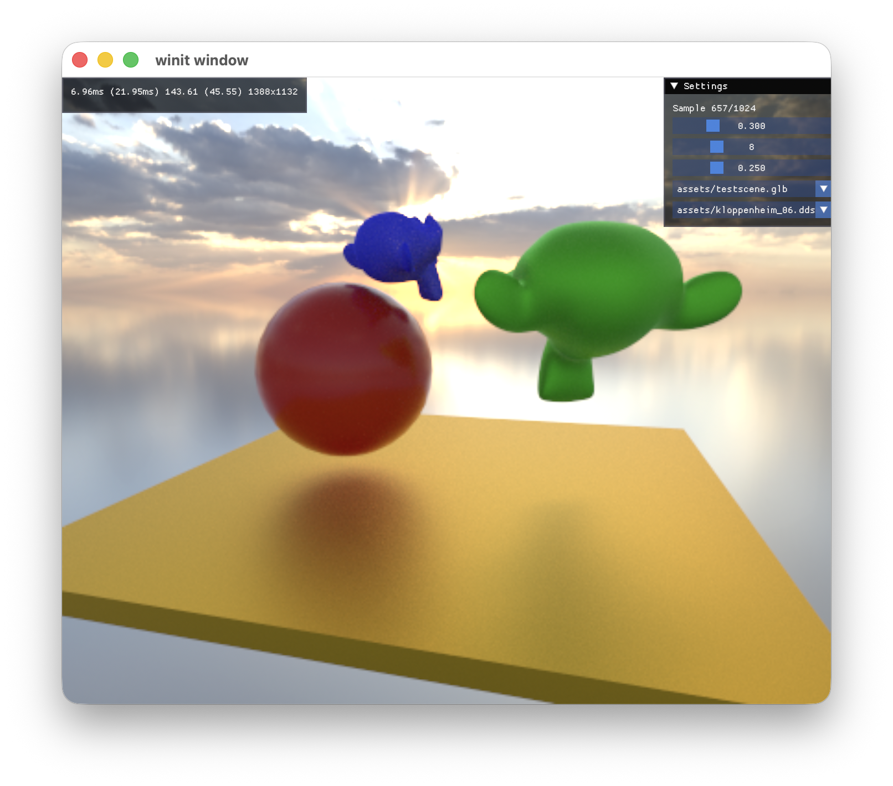

# nBounce

This is a GPU-accelerated real-time path tracer, fully written in Rust using [`wgpu`](https://crates.io/crates/wgpu).

Thanks to [`wgpu`](https://crates.io/crates/wgpu), this implementation is fully cross-platform, supporting Metal on macOS and Vulkan on Windows and Linux. However, due to the advanced GPU features required (some of which are not yet exposed by WebGPU) this will not natively run in the browser via WebAssembly (WASM). Future additions to the WebGPU standard might change this limitation.

## Planned Features
- [X] Software ray tracing using SAH-optimized BVH trees and Möller-Trumbore intersection tests
- [ ] Hardware-accelerated ray tracing
- [X] Random Quasi-Monte Carlo sampling with a precomputed Owen-scrambled Sobol sequence [^1] and per-pixel random Cranley-Patterson rotations using [`sobol_burley`](https://crates.io/crates/sobol_burley)
- [X] Unbiased Russian Roulette path termination based on path length and perceived throughput luminance
- [ ] Neural Radiance Caching [^4]
- [X] Support for environment lighting and emissive materials
- [ ] Texture and normal map support using [`ddsfile`](https://crates.io/crates/ddsfile)
- [X] GLTF parsing (requires precomputed tangents and normals) using [`gltf`](https://crates.io/crates/gltf)
- [ ] Support for transmissive materials
- [X] Basic Disney BRDF: Burley Diffuse + Trowbridge-Reitz Specular PBR materials [^2]
- [ ] Importance sampling of the Disney BRDF using preintegrated diffuse and specular textures
- [X] Importance sampling of the Visible Normal Distribution Function (VNDF) [^3]
- [ ] Importance sampling of environment maps
- [X] HDR output on macOS
- [ ] Timer queries for detailed performance statistics
- [ ] GPU-side neural networks using f16 matrix multiplication

## Features Not Planned (Yet)
- MikkTSpace tangent generation
- Advanced Disney BSDF: Subsurface scattering, sheen, clearcoat
- Implicit light sources: Directional, spot, point
- Animation support
- Neural supersampling
- Neural denoising (OpenImageDenoise)
- Depth of field
- Tensor core utilization
- Volumetrics
- Numerically robust triangle intersection tests

## References

[^1]: [B. Burley, “Practical Hash-based Owen Scrambling,” vol. 9, no. 4, 2020.](https://www.jcgt.org/published/0009/04/01/paper.pdf)

[^2]: [B. Burley, “Physically Based Shading at Disney”.
](https://media.disneyanimation.com/uploads/production/publication_asset/48/asset/s2012_pbs_disney_brdf_notes_v3.pdf)

[^3]: [E. Heitz, “Sampling the GGX Distribution of Visible Normals,” vol. 7, no. 4, 2018.
](https://jcgt.org/published/0007/04/01/paper.pdf)

[^4]: [T. Müller, F. Rousselle, J. Novák, and A. Keller, “Real-time neural radiance caching for path tracing,” ACM Trans. Graph., vol. 40, no. 4, pp. 1–16, Aug. 2021, doi: 10.1145/3450626.3459812.
](https://d1qx31qr3h6wln.cloudfront.net/publications/mueller21realtime.pdf)

